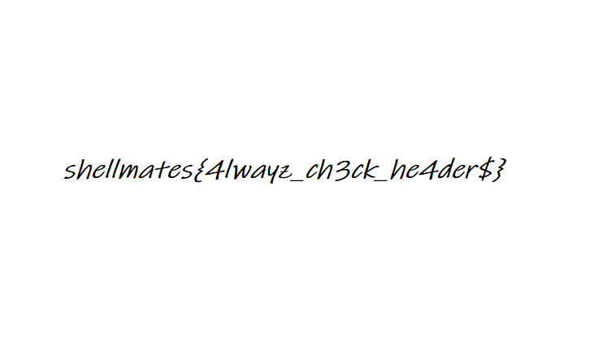

# Hills

## Write-up

This is a steganography challenge, we have the famous windows xp wallpaper 'Bliss' showing green hills.
The challenge description says that the flag is hidden behind the hills, this refers that the flag is somewhere inside the png image.

1. After running `file` command we get :
```txt
$ file green-hills.png
green-hills.png: data
```
We notice that the file type is actually `data` and not `PNG` , that means there must be something else inside the image other than the image itself.

2. By running `xxd` :
```txt
$ xxd green-hills.png
00000000: 8950 4e47 0d0a 1a0a 0000 17ba 464c 4147  .PNG........FLAG
00000010: 7368 656c 6c6d 6174 6573 7b6e 4f74 5f34  shellmates{nOt_4
00000020: 5f66 6c61 477d 4834 7349 4343 7064 7532  _flaG}H4sICCpdu2
00000030: 4141 4132 5a73 5957 6375 6347 356e 414f  AAA2ZsYWcucG5nAO
00000040: 3359 2b56 6353 324e 3848 6342 7966 6171  3Y+VcS2N8HcByfaq
00000050: 6f78 7037 4778 5230 3264 736a 4a7a 7930  oxp7GxR02dsjJzy0
00000060: 7764 6357 4779 7a4e 774c 4c58 5044 4c4d  wdcWGyzNwLLXPDLM
00000070: 3064 636b 4545 5261 6270 3239 6370 5454  0dckEERabp29cpTT
00000080: 4d55 4d31 7a47 6664 3858 5845 426d 786c  MUM1zGfd8XXEBmxl
00000090: 7852 3046 7849 4563 7755 5546 4651 5546  xR0FxIEcwUUFFQUF
000000a0: 4542 6566 722b 4663 397a 7a6a 5033 6e4d  EBefr+Fc9zzjP3nM
000000b0: 2b35 352f 3336 3458 4e2f 2b64 787a 3772  +55/364XN/+dxz7r
000000c0: 6b76 3737 6735 4b42 3154 5077 5941 414a  kv77g5KB1TPwYAAJ
000000d0: 5163 6239 3845 4177 4466 6341 4141 6854  Qcb98EAwDfcAAAhT
000000e0: 2b2b 2f65 6172 6850 3167 7476 7831 5534  ++/earhP1gtvx1U4
000000f0: 6746 4f39 6742 3671 6c6e 5672 3647 2f77  gFO9gB6qlnVr6G/r
...
```

We notice this leet flag-format text `shellmates{nOt_4_flaG}` saying that's not a flag. 
while the chunk header is `FLAG` !

> FLAG is not a PNG chunk header !
> Check PNG chunks [here](http://libpng.org/pub/png/spec/1.2/PNG-Chunks.html)


then when we run `strings green-hills.png | grep -i shellmates` 
we notice that dump here :
```txt
FLAGshellmates{nOt_4_flaG}H4sICCpdu2AAA2ZsYWcucG5nAO3Y+VcS2N8HcByfaqoxp7GxR02dsjJzy0wdcWGyzNwLLXPDLM0dckEERabp29cpTTMUM1zGfd8XXEBmxlxR0FxIEcwUUFFQUFEBefr+Fc9zzjP3nM+55/364XN/+dxz7rkv77g5KB1TPwYAAJQcb98EAwDfcAAAhT++/earhP1gtvx1U4gFO9gB6qlnVr6G/wq57nodAGjKOC4NPPQ1H3162zsWADjR+59SGIBVBgEA/63kePO6ZwJkfS7iEd6acHjMtP5E5eJKKGso7sr8yZ+OKvxwesC1Bd+WbOb34Zad8PHAilymDPhMUfEG/Aq4qQr4CZB5CPDtL0EKgG++/4f+oX/of4N+HRLI386TRe5JlueOA6QCcYO2PEe6e6E5yftrxnhQj4HkkhrvBXKhWJEiMJAPhpz07mmdl8v290Tc6GOv22M9IOcm1HMtiLkK++3JNLLPbncDadzAe8EY0xUt18HNd7LWBjLIZ9p6fsxkZ4JkTgSz94MBj34buHd4U/7RCWtBylVAtdDyEdqbatn9K68Th2U3HQ1ST7liZNImT1sTBihlUPihglr3dkl8WiOK+++tg0vKCzWwNLAiNmAx57jiFlRQiNjzkNmzdk4Er4F0mpKKuDwUOG9XXYx1MDI8rvfKxTsoGu0cPDgqpp1ttt5UOw42QS1oRMlRuID0pCKaC292N8a17EULP8P0l0BiGMtQkJpTHs/aesaoMPi+MCbzCN/llQp7i5xoVeYhrq+pJsD+xhzLZD/bfys+SuOE+u+H86bGvPwfBGgR4cG2pKoriqcGBlKgGveSpe96QrKkkYSewD+HP8nHD30x9SpyttDty50Lw8T2lHJLWLdQPyePCkKT3WkDr2mvbYPHqm7iJLbRdZX6f0HPZbRjLAPC/V1jbIxzPKySzfmyr60HUwrKRmvuJpvMVursbDpsd1/AdWO/TM67GjCuSOxOXpSGqHjzKVieyvSr8eatF7ia2LIx46sZoPtUvkCR+v6o6S+ZRFvB8Omcj0O984dwZyW7Lft6L9kqXkUeyhf7quZGAh5cOkG+kFTkzOt9/DdGPTM4RIomitoe7VH6l5Qy+MsvYET0PvU2bJoL6khyuOueZQcKPKueQV/VYdemgmWLv0ablih8AaPAFC8tBEbjQEisMa4OCfBHAYMWgaCQDRDsR+BmKDhuJCxw8+8Z2Jv7I9YPRPQori3aGhphLB0/GeIclFuqd220iK3ggqI99AZktET4fMChsalchLdQ2NTSe7SkDdaITkjwmH4SQDWhHYCL6ySr3a/Kio8cH38NDZtTa5hOWHOb0sqbbTg+2ZF5cNuFsrhU238GiGioowfWJlwFalBe0JIfF74vSK6S68qxuTuO+W2IjSIkIjvEIbZC0EoNcSWtiu4XZaLyV9I0sI+4GzP9S2trGmVa9JadPP9WP54x+WLShaZrddKFhEGqRYYB/ug1cqMLyrTShSrrgZddVlLiBpA+SZUa5MM3yKDFVafuddk9HdeqYF4xdQA49bYb27pSiuJvXMSOKxnk8A1+JnQFx2OI7U4w6wc5q38aRYDJeAug2J/2Po1ae6TN4q1+j9FuUlwMRD3oLSqDVBO5D0SOIdxbEYVGlrIxSNVEVUvbFnipMjHFTXDw+Un+86sc6ojD+YYeKqnIYrWR9Q56ZBtI0LWv8U/yKWkRZHe5R2+rZN3TrCz/fBWAnJBVdN+/h3rmvo3WobzHVugKVsf1afvx8VFa4oOz9patNyVwD/LoDdOSdYmalXeAQEgWUpvRYStjngOzznj71cjf6HaYMkJHWJEjbJyBcGR4OCfmMIVPiTtOJQg+0gblj4XmYWq7C1qXC7q0WmbQi6gh9vIZ88is1LV47Xn6xRCdgy6obL3M6SUD+mnuvvzNcTY8SnPBg8Czvn93IDTbZ8hKe/8pLOtGQwXjruXT9eZm9n06fWKiLCQs8J1FUuPk+n6OVeJKavMcO8O7i815jeA/BB8RcZ73MtATg+CCtW6aP6w5y/Kear2MVtMa7po4689LHeVvsLIvejHo8bPA2Q9vCe5yqEXGdrgfde406dLRYMuwiH2DoP3ej+1k7TjKxOZs6Lwq/Pj8Mu6Nvg2veRwwpUmC1KxrxUNOjNeNW0aV+RHXXGWtJ1hC8N1/h/r1H5lM9/YtBH2BAYvpVUhfEkVG85pO7967xqwUjeVgtzspJMsoZ05+w+4DWFZTZDy8cLuA/4xdYLEdN+VsYZMcv/Mc7GzqoU85WxJo6ABVH2TCkUfsReKQiWxznlrhF6tbONYICGFdUvudqwbSac3XcKLBpVRE+5Gh9kk9yjh7CtmR+3xU2VmREli2u740v1r/PeXlhIt/sgvhqiMyyLY9G0TRrB9T7iqbWzxgGY9qnx6pYEmDOOH+1itN44ALJS0UtOuOZHZhtcMU6NgTQ85dpK5sx5k+3HszoIkZqPTyGcik+UJHutPDEmLJ8HLWn/lA3vWy33fCkhmUWQfU4szl1s1njib6wYSB7KihwDmtbB+rA6964ZhfGyRWE0uMSgIHXK6axsAlxBlxqgFJLa4oD1y4xup6Q9jmbl+bKc/N0d5aAE7Dgoho8uO9JqmnbhDkkBOpd7p51p5xoTjSSGkKaYX511tFJ0v45E6x59MSX2h7QuN9BOy6jxen9+93NTb6C7XOlBUGcHi6Lz6gh3uwDU13a6miK8iKfSrsk+4YxiftLd3BGKFiP3rTTkfErzvRmJ+XEuFQqxbkG9b+Raki6W7719vjq40/NeQTF+u5PhU030RzMrQPSjlH4KiKiqpGW0OzvwgVEG03klD2LIHkFo5qcGZIRQc00/mM6bkOZY5W7mFTWiwkwT187l+hEuiA0MOmOisr5En+O5nGJSf5WnyFNxBWkFax+3kpv7xqCEnIuqidRi9GZr83ejq9qasfCx6Ogl42TB5CrcWfiR/ecyVM4YfbdTkqKKY0NE74V341kNCKpWkqbx/5DvrlIUNZ1q02/3iWgH793pBclJdsb4m26+CvmW00UldMKHR84TJR7A/hv+bMvPOrt5tJ0e37Qz48PcPfQz1YLa+quXu5XBLuhucL/no4BVlBHMfMiaV9Y080fW3P/ozcN4/oi1+oREXY52JE4juidtJKzhd4gO3CFfEtBl2/NDzmUERgWWlwsla7NjQQvLNuNNVzbsfd7zu3edScoftATZN/wX7wVPER5zszIPSutbwTFtXUbnHmj6Emj2FcoZyd8Zu5LoeU359uOPrvEtNLNaw7AvUwBJiaB2FNKG5NT3V6MkgJ+todc2OclKnGlmm8C0djGRTJi5aUF057u8wbjyayVqZYl6aYBdCWj4awwlOU6V5G5cwEmGHCQvSVnWqcbtGl3Hgrjp/ikeC2GyMWsv2oq+RDDKKqW8ajkM4wXIpwRIvjwBp3owHl/bF6JFXd7byDM9owGGVIHml0vx40k4eamUumxdh5B7tBQyd/qcmCk32bGYtT1YKXhx1wr5QvuBszRD5E9A1zfEBvxZynm9rOcuS8fpTyEoaQPz5zLTEwrss1m6KL12R89ii1chXPkBroWTVbwAithdk61202yyE/JjKSWi36xd/6LE9nTFDOgLsdfHaeSSXdfWV1phvoQpjVkSRirugdNjNil173LpgePaSV48NbO/GxjL11LSjsGkNslpKtW5NjpfcG9J+h7N8K7+jBuitHs2x96a+kDVTpz/zOzSRaQ/moXgknJcc/54W0Ycdnr3ZoZ+R6bFkTc0dqZ17Xt/cBe9SqthVV5At0G4i4B6uS2338kNuK8U7PqImWRUvD46IZSHEMhQE1AtUh3hDWYGGJPnAT4EAUG6fLRIkUnhtJGv9Cu+D8eeltu1+PtVy0EcOduwJCLGOqtxTv+SHrLMKjJdywNjxUkHuK3cWgcOrCHh94JSobZ/lQl+P6lJxhZqNTvtpt7yTiPt7mxXOUaquIYZ/NGmmJaUl/RN/GCqTcoVvyafBRK9oQ0WTzU2F2aZsuDL+N10+BZfgHnJxQ7gVW83QgyzgV5ubwsPPuH3VPkMB3LENqADrX3RoWEgNnjB6Ao/USMOEsMrkQ3DsxPgOdY8ZWsNBIfz3DctYQyNpU62AhLuFnQQHP5qaYVxuii7nMcYXwXm+igxgMJL30Ug5TtTPPtDBTOZSW/CD8I3k4ytWyJibguTkNhv/68rwm1JmxzWTrjXbRhJutV/MP05Ih6uZWVvSC1+0CJwa/gQ7yHMMvM9nFtQEXNtN4l5xsZIkFxDHDiltm7NOiwDZ8AX7ykKV2Y1eontqPd2tJidIvwztzSUv8A9AV4LYto+EFJyoFYkS3FBzsVS6QCvTZW7CnjFBD9LhhNWaClsVrfW1dZapJjPONl6VWehGnNYJvHrnRhYd2R5TiIHmnBuzi6atxSy1gXXbawdGcmMzRGbPGbUH4fai0L1V44pzzlO9bc1HChgGiPNRmfTeywSNq4kFF5kyopL2Vye8CnKmfz10O9pjoFwhHW7vqYscgFSskLjPmYmHMpSo/du20vLkGFpbV3I8w0/qjVrOi1ObpRM1eB/OFeYqBVhqVMyuqADyPSTGMXLqUcPXvECeT9ZW9rtMvxKnqc8MqTEYymDtrt4fqXxv9i93HqqzQPFKbxXQjWLi+enzW8niWIa+Nqx2i7OxPOIEqESBkqeVJJHb4hBc2JqJE0HSqjMrPF+ndxHmj1Zbd04aW9Wzcxp8chlKrPUqIFpBslR3Tp60k0odAboKjZb2q5DF+hdGKevysI3pQBFVTT/O6ym86PclSa49Hds5+iEQ8sJRwG9iVaH1t7XwhsJX4nVK6AX5AFoAZB3ELctYa0NOPSIIgT09+N8t13sO4OeqLY/7ot9R704jVFsShHK/Eksl2G172SrvJMiFy/mw3a077jY0hHHSb/lFNZPEv7kk90vZjGc4NkyAehgesAVmfGfa4MHUX7QQcNxaSJhKRMeH4tkdbaTtct9gv1ibvBQ3wils2yRaHHBgM/e8Qms62/LD3jqTmg0TfxY60e4gLs94NuLll3BB2M7x+o8CsrL7UqxfEz4Wb8Fs/8teubfaMe2fpIOC1Sgbkb0NHMD+BxZAeue2EX9kJ6cNJuqRnbZeSyPdt6St6dgRer/ipvdn2jxkh4dpz1XrSnMboS4+ThHKGEhdbzM//xm4vxON+w0BBjo+PGnwQUre67Ng4MnqmQM12XPzKgBczWeuA5RMfcMefPtmivxrig1Qc3Tj9xGFXfQb/1/Edzq300wUBixNtQlpNDDjRortzrtPzag+lWjWu6XfrVRzHXJBGl12GVuebEjcXAD+2FSe7nvZKoC8bOEUM2K0yZuot0D5jcfZX+c2cPxeusHq4JRyIxGyuXtSaFpeL1KKC5Tb1Lbt3YNZ4KMHPupnBwhsRbKqJipZ5ktLJTaz11YZXIs+o55Mt6YNe6IXcxdc9HkEzo+XnSYfTvLDY7cqO2MHzckmUED4R895i7m3LSNH7zg/n5Z/gbaC6oxTjn4QZXkbG76zPNHD+Ja69zNsu3I6tMdpYpONT098lXh4CxfuvFzIfRHuYUq4Y8Vv3J+FViItT22cdRrmxKyM1XnweEOuecDLRHeaCEBWoN+j27X9HihuyKivPXKsPIixZJZiHrrwSuYL8YpBkgdgfh3SaS/ARaSyLHOJy82E+SsudVhBHf7f5lnpiWWeeinzfDrEIX49IEBCdM9wkmN3zsozqnmpjwjESMh3dw30ZrP58D0eWzu2pJslwmIHtEHVlpptzABP/A2XH453VgZPclRwUCh7+InyeDbpwu4Kpmgg2iPjARDb2Z9++Li682LyhXJUbDHn00blvaxYuM98uFNd/ALMeze947ZOQx5JdCp/KmKfxP+Xv+I8oCKmKJpg/zTJSOoTZvxtIPYa7i3EXKoi/S0I1oJVV9NnNqa+auKq7KR8WwG1D/X+1V+1YLNzL3yDfCnqGYQo1qdogiEzn+K/G1/+PfKL8Q//Q/18yFmDkEozdeVvl891V4YCvy9He7Wa93cPf/gf5JYMfeBgAAA==
``` 
It's actually base64 !
Something is encoded in base64 and we're gonna find out what it is.

3. We copy that dump into a file then we run :
```txt
$ cat base64_dump | base64 -d | cat > output
```
4. We run file on output :
```txt
$ file output
output: gzip compressed data, was "flag.png", last modified: Sat Jun  5 11:16:58 2021, from Unix, original size modulo 2^32 6264
```
And we see that it's actually a zip file containg "flag.png" !
Unzip it then opening the "flag.png" file
And Voilà !

> 

We found the flag : `shellmates{4lwayz_ch3ck_he4der$}`


## Flag 
`shellmates{4lwayz_ch3ck_he4der$}`  
